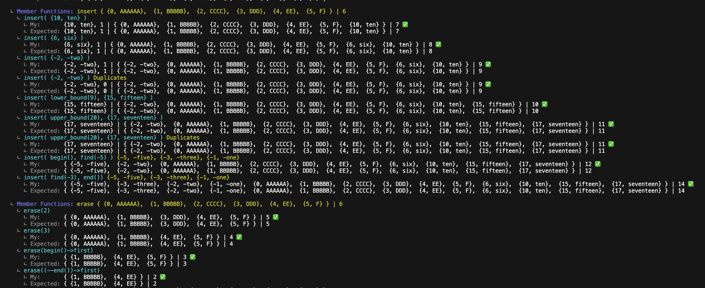

## FT_Container Tester

This is a very simple ft_container tester which tests `ft::vector`, `ft::stack`, `ft::map`, `ft::make_pair`, `ft::pair` and memory leaks check at the end.

To start:
```
git clone https://github.com/hiromasa0629/ft_container_tester.git
cd ft_container_tester
```
To check if your headers are included correctly, if not, simply edit the `INCLUDES` in the `Makefile`:
```
INCLUDES	= ../../header
```
To check if your classes are named correctly, if not, simply edit the macros in `tests.hpp`
```
# define FT_VECTOR		ft::vector
# define FT_STACK		ft::stack
# define FT_MAP			ft::map
# define FT_MAKE_PAIR	ft::make_pair
# define FT_PAIR		ft::pair
```
Then finally:
```
make
./test
```

Example:


